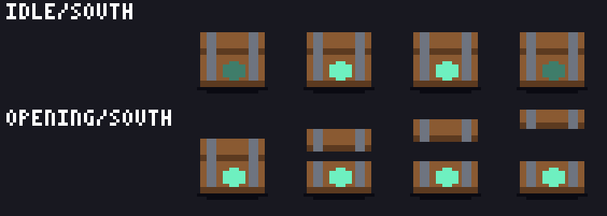
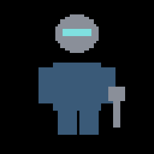
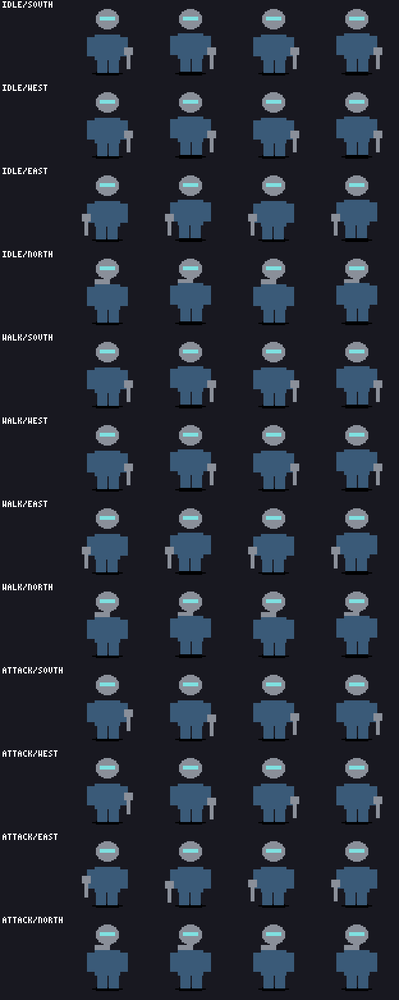
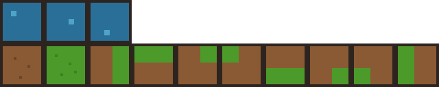

# pixel-forge examples

A real pixel-forge project (`pixel-forge.yaml` + `assets/<id>/<id>.yaml`) with worked
examples covering every asset type. Build it, read the per-asset READMEs for what each
one demonstrates, or copy it as the template for a new project.

Everything below was produced by the toolkit from the YAML in this directory. No image
was hand-drawn or hand-edited.

```sh
uv run pixel-forge build-all --root examples
```

```
built 6 asset(s), 146 finding(s) total
  beacon: ok
  crawler: ok
  engineer: ok
  forest_tileset: ok
  rune_chest: ok
  sporeling: ok
```

## Gallery

### `sporeling` — enemy

Six animations across three directions (60 frames). `east` is generated by mirroring
`west` and is never hand-authored. The full combat state machine is here: idle
breathes, move hops, **telegraph** flattens the cap and lights the eyes as the
fairness cue, **attack** snaps the cap up and out, **impact** squashes, **death**
collapses to nothing but the ground shadow.

 

The contact sheet is the whole asset at a glance, one row per animation and direction:


Events land on the frames the game code needs: `telegraph_start`, `hitbox_on` on
attack frame 1, `hitbox_off`, `hurt`, `death_complete`. See
[`assets/sporeling/README.md`](assets/sporeling/README.md).

### `rune_chest` — animated prop

A static base that is pixel-identical in every frame, a lid that moves purely through
per-frame region offsets, and a rune that pulses by swapping palette entries. The glow
itself is exported to Godot as shader metadata (`energy_pulse`) rather than baked into
frames.




See [`assets/rune_chest/README.md`](assets/rune_chest/README.md).

### `engineer` — character

Four directions with `east` mirrored from `west`, layered regions on named anchors,
per-direction equipment visibility (the weapon hides on `north`, the backpack appears),
and a walk bob that moves the torso without ever moving the feet.





See [`assets/engineer/README.md`](assets/engineer/README.md).

### `forest_tileset` — terrain

Grass and dirt base tiles, a full 8-mask transition set, animated water, terrain sets,
and a sample map. Every tile tiles against itself with **zero** mismatched edge pixels.
The animated water frames sit in a contiguous strip because Godot's tile-animation
model requires it.



See [`assets/forest_tileset/README.md`](assets/forest_tileset/README.md).

### `crawler` — enemy

Two directions with a mirrored `west`, the `combat` block naming its telegraph and
death animations and its hit frames, and events on the meaningful frames. See
[`assets/crawler/README.md`](assets/crawler/README.md).

### `beacon` — animated prop

A static base, a region driven purely by per-frame transform offsets, a visible and
`color_swap` blink, and a `procedural` shader block. See
[`assets/beacon/README.md`](assets/beacon/README.md).

## Semantic editing

The reason the source of an asset is a document and not a PNG: you can ask for a
precise change to one named region and get exactly that, with everything else provably
untouched.

```sh
uv run pixel-forge revise sporeling \
  --operation resize_region --param region=cap --param 'delta=[6,0]' \
  --protect feet --protect shadow --root examples
```


The cap grew 6px, symmetrically about its own centre. The spots, stem, eyes and ground
shadow are byte-identical, the feet never moved, and the palette is unchanged. The edit
is recorded as a revision with before and after hashes, an exact inverse, and the
validation report from the edited state:

```
7d09d8b67f6e: resize_region on sporeling at 2026-08-05T21:12:37Z
  hash: cfd674e7837b9937... -> bdb83cc5223ce6c5...
  regions: cap
```

Run it against a copy rather than this directory if you want to keep the committed
example at its original width.

## Building it

`--root` is a per-command option, so it comes after the asset id. All of these have
been run against this project:

```sh
uv run pixel-forge build-all --root examples
uv run pixel-forge validate engineer --root examples
uv run pixel-forge render forest_tileset --root examples
uv run pixel-forge export godot beacon --root examples
uv run pixel-forge preview sporeling --root examples --scale 4
```

`build-all` renders, previews and exports every asset into `examples/build/`
(git-ignored) and reports 0 blocking findings for all six.

## About the remaining warnings

The 146 findings are all `warning` or `info`, never blocking. Most are `PIX007`, a
heuristic that flags a colour covering a small share of the silhouette edge. On the
`sporeling` it fires on the stem colours, because a mushroom stem legitimately pokes
out below the cap and there is nothing wrong with it. This is the documented
"heuristic rules are untuned against real art" limitation, visible in practice. Each
asset's README lists its own warnings with a justification.
