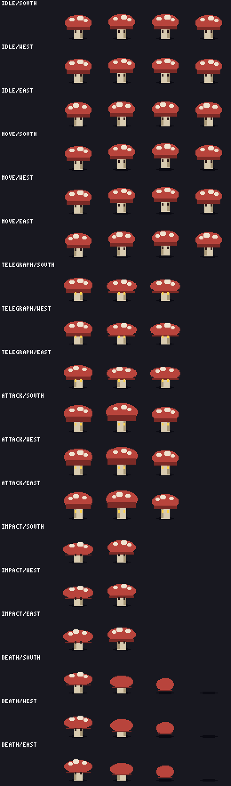

# sporeling (enemy)

A mushroom creature, 48x48, three directions, six animations, 60 rendered frames.



## What it demonstrates

- **The full enemy state machine.** `idle`, `move`, `telegraph`, `attack`, `impact`,
  `death`. `telegraph` exists so the player gets a readable wind-up before damage.
- **Frame events.** `telegraph_start`, `hitbox_on` (attack frame 1), `hitbox_off`,
  `hurt`, `death_complete`. These become metadata on the imported Godot resource for
  your game code to hook.
- **The `combat` block.** Names the telegraph and death animations and the hit frames,
  so a game can drive the creature without hardcoding animation strings.
- **Direction mirroring.** `east` is produced by flipping `west`. It is never
  hand-authored, and the spots pattern mirrors with it.
- **Squash and stretch through `scale_size`.** The cap flattens on telegraph, expands
  on the attack, and collapses on death, all as size deltas on existing shapes rather
  than as redrawn frames.
- **Visibility swaps.** `eyes` and `eyes_lit` are separate regions; the telegraph and
  attack frames switch which one is visible.

## Design notes, and the rules that forced them

Two constraints shaped this asset, and both are worth knowing before authoring your own:

**The shadow is never transformed.** It sits at the `feet` anchor and no animation
touches it, so the frame's lowest opaque row is always y=43. That is what makes
`ANI001` (baseline stability) hold by construction rather than by luck. Every bob and
hop moves the cap, spots, stem and eyes, never the shadow.

**Shrinks are bounded by the smallest shape they touch.** The `cap_dark` rim is 4px
tall. An early draft of the death animation used `scale_size: [-4, -7]` and the
renderer refused it outright:

```
region 'cap' shape #1: scale_size (-4, -7) would shrink size (26, 4) to (22, -3);
minimum is 1x1 per dimension
```

The same draft also offset the stem downward on the collapse, which pushed it below
the shadow and produced three blocking `ANI001` errors. The fix was to shrink the stem
instead of moving it. Both problems were caught by the tool, not by eye.

**All motion is vertical.** The frame's bounding-box centre-x never moves between
frames, which keeps `ANI003` (pivot drift) quiet without any special handling.

## Validation

0 errors, 123 warnings, not blocking.

| Rule | Count | Why it is acceptable |
|---|---|---|
| `PIX007` | 120 | Heuristic: flags a colour covering a small share of the silhouette edge. It fires on the two stem colours because a mushroom stem legitimately protrudes below the cap, so it owns a small slice of the outline. Nothing is wrong with the art. |
| `ANI008` | 3 | Silhouette volume changes 85% on the last death frame. That is the creature disappearing, which is the intended effect. |
| `PIX010` | 1 | Info, not a warning. No palette colour declares a lighting `role` or `ramp`, so the lighting heuristic has nothing to check. |

## Build it

```sh
uv run pixel-forge render sporeling --root examples
uv run pixel-forge validate sporeling --root examples
uv run pixel-forge preview sporeling --root examples --scale 4
uv run pixel-forge build sporeling --root examples
```
