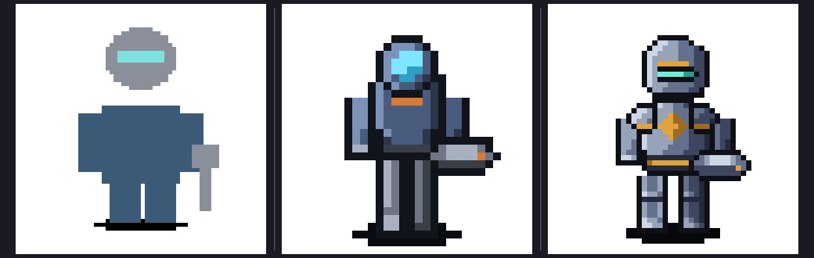

# warden (character, 48x48, bitmap regions)



Left to right: `engineer` built from shape primitives, `vanguard` (32x32 bitmap
regions), `warden` (48x48). Same pipeline throughout.

## What it demonstrates

`vanguard` proves bitmap regions work. This one is a deliberate attempt at the ceiling
of what the format supports:

- **A five-step steel ramp**, `steel_hi` through `steel_deep`, so the armour turns
  rather than reading as a flat patch. Light is consistently upper-left: the highlight
  runs down the left edge of every region, the deepest shade down the right.
- **A hard ink outline** on every region, which is what separates the figure from the
  background and keeps the arms from merging into the torso.
- **Gold trim** with its own two-step ramp, used sparingly: a chest diamond, a belt,
  and a band on each pauldron.
- **A lit visor** with a two-step ramp of its own.
- **Nine regions.** Separating the pauldrons and arms from the torso is what makes the
  walk cycle possible without redrawing a single frame: the animation swings the
  pauldrons in opposite phase using nothing but per-frame offsets.
- **Mirroring and per-direction colour.** `east` is `west` flipped, so the weapon
  changes hands for free. `north` uses `color_swap` on the bitmaps' palette keys to
  turn the visor and the gold to steel when the character faces away, rather than
  needing a second set of art.

## Authoring notes

Four passes through `pixel-forge view`, each fixing something invisible in the YAML:

1. Pauldrons floating away from the body, and no arms at all. The pauldrons were
   anchored at the torso's outer edge instead of on top of it.
2. Legs too long for the torso, giving a stilt-walker silhouette. Shortened from 14
   rows to 11 and pushed the torso and head down to match.
3. The gold read as two flat horizontal stripes. Replaced the chest bar with a
   diamond and added a knee break so the legs were not one straight column.
4. Validation caught 32 blocking `ANI001` errors: the shadow ellipse extended one row
   below the declared `baseline_y`. One character in the spec.

## Validation

0 errors, 81 warnings, not blocking.

| Rule | Count | Why it is acceptable |
|---|---|---|
| `PIX007` | 80 | Heuristic: flags a colour holding a small share of the silhouette edge. On a five-step ramp the darkest shades legitimately appear on the shadow-side edge in small quantities, which is what a lit form looks like. The rule is calibrated for single-tone art. |
| `PIX010` | 1 | Info. Reports the light direction it inferred from the palette's `role` metadata. |

## Build it

```sh
uv run pixel-forge render warden --root examples
uv run pixel-forge validate warden --root examples
uv run pixel-forge view warden --animation idle --direction south --scale 8 --root examples
uv run pixel-forge build warden --root examples
```
